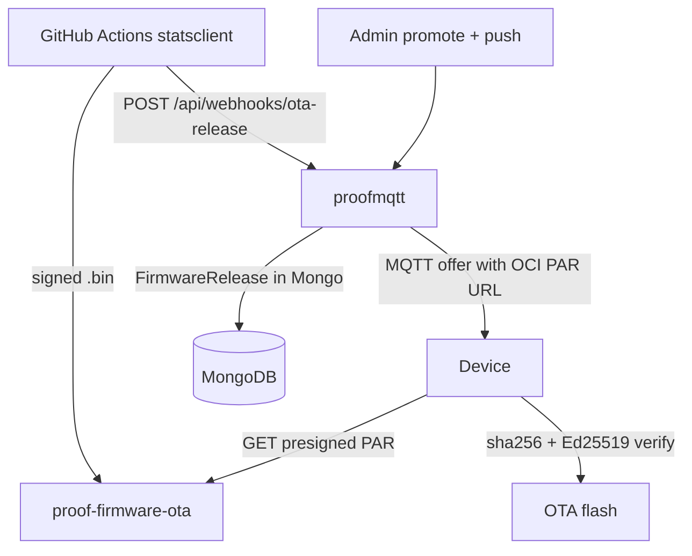

# OTA dev download test (temporary)

Firmware HTTP download smoke test — **separate from production OTA**. Use this while validating that the device can stream a binary over HTTPS without going through the full signed release pipeline.

**Remove when done:** delete the `test:1.1` route block in [`src/routes/otaRoutes.ts`](../src/routes/otaRoutes.ts) (search for `ponytail: dev-only open download test`).

---

## What was added (dev only)

| Item | Value |
|------|--------|
| **OCI bucket** | `proof-firmware-dev-download` (brand new, public read) |
| **Production bucket** | `proof-firmware-ota` — **not modified** |
| **Object key** | `dev/wifi_ap_project.bin` |
| **proofmqtt route** | `GET /api/v1/ota/download/test:1.1` |
| **Server auth** | None — no mTLS, no device cert, no Mongo release |
| **Code touched** | [`src/routes/otaRoutes.ts`](../src/routes/otaRoutes.ts) only |

### Download URL for firmware developer

```
GET {PUBLIC_BASE_URL}/api/v1/ota/download/test:1.1
```

Examples:

- Local: `http://localhost:3002/api/v1/ota/download/test:1.1`
- Deployed: `https://server.withproof.io/api/v1/ota/download/test:1.1`

**Response**

- `Content-Type: application/octet-stream`
- `X-Firmware-Version: test:1.1`
- Body: firmware bytes proxied from the dev bucket

**Artifact details** (current upload)

| Field | Value |
|-------|--------|
| Source file | `statsclient/build/wifi_ap_project.bin` |
| Size | 1,124,448 bytes |
| SHA-256 | `34a9b89edbcaa1c4a9240a0559055b64f72338b11e594f20d70fdb13f32910a6` |

### Direct OCI URL (optional sanity check)

Anonymous GET — no proofmqtt involved:

```
https://objectstorage.ap-hyderabad-1.oraclecloud.com/n/ax4egmknthnr/b/proof-firmware-dev-download/o/dev%2Fwifi_ap_project.bin
```

Verify:

```bash
curl -fsSL -o /tmp/fw.bin "http://localhost:3002/api/v1/ota/download/test:1.1"
sha256sum /tmp/fw.bin
# expect 34a9b89edbcaa1c4a9240a0559055b64f72338b11e594f20d70fdb13f32910a6
```

---

## What this does **not** do

- Does **not** register a `FirmwareRelease` in Mongo
- Does **not** use `OtaService`, PAR minting, or MQTT push
- Does **not** verify Ed25519 signatures (device still would if using full `ota_handler` apply path)
- Does **not** change [`otaDefaults.ts`](../src/config/otaDefaults.ts), `.env`, or `proof-firmware-ota`

This path is for **HTTP download / streaming tests only**.

---

## Original production OTA flow (unchanged)

Production OTA is documented in:

- [`docs/OTA_FIRMWARE_CONTRACT.md`](./OTA_FIRMWARE_CONTRACT.md) — server API + storage contract
- [`Proof Display OTA .md`](../Proof%20Display%20OTA%20.md) — device architecture

### High-level production path



### Actions required for a **real** OTA release

Nothing changed in this pipeline. To ship firmware to devices in production:

1. **Build & sign** firmware in `statsclient` (Ed25519 over SHA-256 hex string).

2. **Upload to production bucket** `proof-firmware-ota` (not the dev bucket):
   ```bash
   npx ts-node scripts/ota/upload-firmware-oci.ts \
     --file /path/to/firmware.bin \
     --version 4.3.x
   ```
   Or CI uploads via GitHub Actions, then calls the release webhook.

3. **Finalize release** (signature verified server-side):
   ```bash
   npx ts-node scripts/ota/upload-release.ts \
     --file firmware.bin --version 4.3.x --sha256 "<hex>" --signature "<base64>"
   ```

4. **Confirm signing** (once, after first successful device OTA):
   - `POST /api/v1/admin/ota/signing-confirm` with `{ "confirmed": true }`, or
   - `OTA_SIGNING_CONFIRMED=true` in env.

5. **Promote to stable**:
   ```bash
   POST /api/v1/admin/ota/releases/{version}/promote
   ```

6. **Push to device(s)**:
   ```bash
   npx ts-node scripts/ota/push-update.ts --device DEVICE-ID --version 4.3.x
   ```

7. **Device receives** MQTT payload with `download_url` (OCI presigned PAR), `sha256`, `signature`, `size_bytes` — then runs full v4.3 validation before flash.

### Production env (secrets only — bucket is hardcoded)

```bash
OTA_ENABLED=true
OCI_TENANCY_OCID=...
OCI_USER_OCID=...
OCI_FINGERPRINT=...
OCI_API_PRIVATE_KEY_BASE64=...
OTA_ED25519_PUBLIC_KEY_BASE64=...
OTA_RELEASE_WEBHOOK_SECRET=...
```

Bucket `proof-firmware-ota` / namespace `ax4egmknthnr` / region `ap-hyderabad-1` are fixed in [`src/config/otaDefaults.ts`](../src/config/otaDefaults.ts).

### Production download modes

| Mode | How device gets firmware |
|------|--------------------------|
| **presigned** (default, Railway/production) | MQTT offer includes short-lived OCI PAR URL → device GETs `proof-firmware-ota` directly |
| **proxy** (local mTLS lab only) | `GET /api/v1/ota/download/:version` with device mTLS → server streams from `proof-firmware-ota` |

The dev route `test:1.1` is a **third, temporary path** — not part of either production mode.

---

## Re-upload firmware to dev bucket

When `statsclient/build/wifi_ap_project.bin` is rebuilt, upload only to the **dev** bucket:

```bash
oci os object put \
  --namespace-name ax4egmknthnr \
  --bucket-name proof-firmware-dev-download \
  --name dev/wifi_ap_project.bin \
  --file /home/statsnapp/Desktop/statsclient/build/wifi_ap_project.bin \
  --content-type application/octet-stream \
  --force
```

No proofmqtt restart needed unless the object key or public URL changes (the route hardcodes the URL).

---

## Cleanup checklist (after device test passes)

- [ ] Remove dev route from [`src/routes/otaRoutes.ts`](../src/routes/otaRoutes.ts)
- [ ] Delete OCI bucket `proof-firmware-dev-download` (optional — or keep for future dev)
- [ ] Remove or archive this doc if no longer needed
- [ ] Confirm production paths only: **mTLS** device routes + **HMAC/Bearer** webhooks + **presigned PAR** or mTLS proxy download (see [`SECURITY_PENTEST_REPORT.md`](./SECURITY_PENTEST_REPORT.md))
